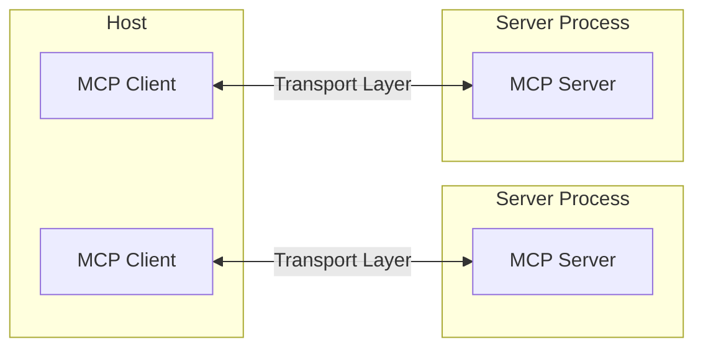
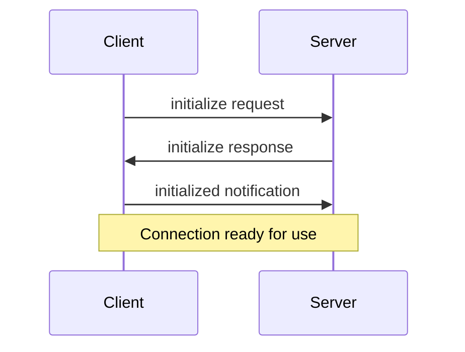

# Core architecture
Source: https://modelcontextprotocol.io/docs/concepts/architecture

Understand how MCP connects clients, servers, and LLMs

The Model Context Protocol (MCP) is built on a flexible, extensible architecture that enables seamless communication between LLM applications and integrations. This document covers the core architectural components and concepts.

## Overview

MCP follows a client-server architecture where:

* **Hosts** are LLM applications (like Claude Desktop or IDEs) that initiate connections
* **Clients** maintain 1:1 connections with servers, inside the host application
* **Servers** provide context, tools, and prompts to clients



## Core components

### Protocol layer

The protocol layer handles message framing, request/response linking, and high-level communication patterns.

<Tabs>
  <Tab title="TypeScript">
    ```typescript
    class Protocol<Request, Notification, Result> {
        // Handle incoming requests
        setRequestHandler<T>(schema: T, handler: (request: T, extra: RequestHandlerExtra) => Promise<Result>): void

        // Handle incoming notifications
        setNotificationHandler<T>(schema: T, handler: (notification: T) => Promise<void>): void

        // Send requests and await responses
        request<T>(request: Request, schema: T, options?: RequestOptions): Promise<T>

        // Send one-way notifications
        notification(notification: Notification): Promise<void>
    }
    ```
  </Tab>

  <Tab title="Python">
    ```python
    class Session(BaseSession[RequestT, NotificationT, ResultT]):
        async def send_request(
            self,
            request: RequestT,
            result_type: type[Result]
        ) -> Result:
            """Send request and wait for response. Raises McpError if response contains error."""
            # Request handling implementation

        async def send_notification(
            self,
            notification: NotificationT
        ) -> None:
            """Send one-way notification that doesn't expect response."""
            # Notification handling implementation

        async def _received_request(
            self,
            responder: RequestResponder[ReceiveRequestT, ResultT]
        ) -> None:
            """Handle incoming request from other side."""
            # Request handling implementation

        async def _received_notification(
            self,
            notification: ReceiveNotificationT
        ) -> None:
            """Handle incoming notification from other side."""
            # Notification handling implementation
    ```
  </Tab>
</Tabs>

Key classes include:

* `Protocol`
* `Client`
* `Server`

### Transport layer

The transport layer handles the actual communication between clients and servers. MCP supports multiple transport mechanisms:

1. **Stdio transport**
   * Uses standard input/output for communication
   * Ideal for local processes

2. **HTTP with SSE transport**
   * Uses Server-Sent Events for server-to-client messages
   * HTTP POST for client-to-server messages

All transports use [JSON-RPC](https://www.jsonrpc.org/) 2.0 to exchange messages. See the [specification](/specification/) for detailed information about the Model Context Protocol message format.

### Message types

MCP has these main types of messages:

1. **Requests** expect a response from the other side:
   ```typescript
   interface Request {
     method: string;
     params?: { ... };
   }
   ```

2. **Results** are successful responses to requests:
   ```typescript
   interface Result {
     [key: string]: unknown;
   }
   ```

3. **Errors** indicate that a request failed:
   ```typescript
   interface Error {
     code: number;
     message: string;
     data?: unknown;
   }
   ```

4. **Notifications** are one-way messages that don't expect a response:
   ```typescript
   interface Notification {
     method: string;
     params?: { ... };
   }
   ```

## Connection lifecycle

### 1. Initialization



1. Client sends `initialize` request with protocol version and capabilities
2. Server responds with its protocol version and capabilities
3. Client sends `initialized` notification as acknowledgment
4. Normal message exchange begins

### 2. Message exchange

After initialization, the following patterns are supported:

* **Request-Response**: Client or server sends requests, the other responds
* **Notifications**: Either party sends one-way messages

### 3. Termination

Either party can terminate the connection:

* Clean shutdown via `close()`
* Transport disconnection
* Error conditions

## Error handling

MCP defines these standard error codes:

```typescript
enum ErrorCode {
  // Standard JSON-RPC error codes
  ParseError = -32700,
  InvalidRequest = -32600,
  MethodNotFound = -32601,
  InvalidParams = -32602,
  InternalError = -32603
}
```

SDKs and applications can define their own error codes above -32000.

Errors are propagated through:

* Error responses to requests
* Error events on transports
* Protocol-level error handlers

## Implementation example

Here's a basic example of implementing an MCP server:

<Tabs>
  <Tab title="TypeScript">
    ```typescript
    import { Server } from "@modelcontextprotocol/sdk/server/index.js";
    import { StdioServerTransport } from "@modelcontextprotocol/sdk/server/stdio.js";

    const server = new Server({
      name: "example-server",
      version: "1.0.0"
    }, {
      capabilities: {
        resources: {}
      }
    });

    // Handle requests
    server.setRequestHandler(ListResourcesRequestSchema, async () => {
      return {
        resources: [
          {
            uri: "example://resource",
            name: "Example Resource"
          }
        ]
      };
    });

    // Connect transport
    const transport = new StdioServerTransport();
    await server.connect(transport);
    ```
  </Tab>

  <Tab title="Python">
    ```python
    import asyncio
    import mcp.types as types
    from mcp.server import Server
    from mcp.server.stdio import stdio_server

    app = Server("example-server")

    @app.list_resources()
    async def list_resources() -> list[types.Resource]:
        return [
            types.Resource(
                uri="example://resource",
                name="Example Resource"
            )
        ]

    async def main():
        async with stdio_server() as streams:
            await app.run(
                streams[0],
                streams[1],
                app.create_initialization_options()
            )

    if __name__ == "__main__":
        asyncio.run(main())
    ```
  </Tab>
</Tabs>

## Best practices

### Transport selection

1. **Local communication**
   * Use stdio transport for local processes
   * Efficient for same-machine communication
   * Simple process management

2. **Remote communication**
   * Use SSE for scenarios requiring HTTP compatibility
   * Consider security implications including authentication and authorization

### Message handling

1. **Request processing**
   * Validate inputs thoroughly
   * Use type-safe schemas
   * Handle errors gracefully
   * Implement timeouts

2. **Progress reporting**
   * Use progress tokens for long operations
   * Report progress incrementally
   * Include total progress when known

3. **Error management**
   * Use appropriate error codes
   * Include helpful error messages
   * Clean up resources on errors

## Security considerations

1. **Transport security**
   * Use TLS for remote connections
   * Validate connection origins
   * Implement authentication when needed

2. **Message validation**
   * Validate all incoming messages
   * Sanitize inputs
   * Check message size limits
   * Verify JSON-RPC format

3. **Resource protection**
   * Implement access controls
   * Validate resource paths
   * Monitor resource usage
   * Rate limit requests

4. **Error handling**
   * Don't leak sensitive information
   * Log security-relevant errors
   * Implement proper cleanup
   * Handle DoS scenarios

## Debugging and monitoring

1. **Logging**
   * Log protocol events
   * Track message flow
   * Monitor performance
   * Record errors

2. **Diagnostics**
   * Implement health checks
   * Monitor connection state
   * Track resource usage
   * Profile performance

3. **Testing**
   * Test different transports
   * Verify error handling
   * Check edge cases
   * Load test servers


# Prompts
Source: https://modelcontextprotocol.io/docs/concepts/prompts

Create reusable prompt templates and workflows

Prompts enable servers to define reusable prompt templates and workflows that clients can easily surface to users and LLMs. They provide a powerful way to standardize and share common LLM interactions.

<Note>
  Prompts are designed to be **user-controlled**, meaning they are exposed from servers to clients with the intention of the user being able to explicitly select them for use.
</Note>

## Overview

Prompts in MCP are predefined templates that can:

* Accept dynamic arguments
* Include context from resources
* Chain multiple interactions
* Guide specific workflows
* Surface as UI elements (like slash commands)

## Prompt structure

Each prompt is defined with:

```typescript
{
  name: string;              // Unique identifier for the prompt
  description?: string;      // Human-readable description
  arguments?: [              // Optional list of arguments
    {
      name: string;          // Argument identifier
      description?: string;  // Argument description
      required?: boolean;    // Whether argument is required
    }
  ]
}
```

## Discovering prompts

Clients can discover available prompts through the `prompts/list` endpoint:

```typescript
// Request
{
  method: "prompts/list"
}

// Response
{
  prompts: [
    {
      name: "analyze-code",
      description: "Analyze code for potential improvements",
      arguments: [
        {
          name: "language",
          description: "Programming language",
          required: true
        }
      ]
    }
  ]
}
```

## Using prompts

To use a prompt, clients make a `prompts/get` request:

````typescript
// Request
{
  method: "prompts/get",
  params: {
    name: "analyze-code",
    arguments: {
      language: "python"
    }
  }
}

// Response
{
  description: "Analyze Python code for potential improvements",
  messages: [
    {
      role: "user",
      content: {
        type: "text",
        text: "Please analyze the following Python code for potential improvements:\n\n```python\ndef calculate_sum(numbers):\n    total = 0\n    for num in numbers:\n        total = total + num\n    return total\n\nresult = calculate_sum([1, 2, 3, 4, 5])\nprint(result)\n```"
      }
    }
  ]
}
````

## Dynamic prompts

Prompts can be dynamic and include:

### Embedded resource context

```json
{
  "name": "analyze-project",
  "description": "Analyze project logs and code",
  "arguments": [
    {
      "name": "timeframe",
      "description": "Time period to analyze logs",
      "required": true
    },
    {
      "name": "fileUri",
      "description": "URI of code file to review",
      "required": true
    }
  ]
}
```

When handling the `prompts/get` request:

```json
{
  "messages": [
    {
      "role": "user",
      "content": {
        "type": "text",
        "text": "Analyze these system logs and the code file for any issues:"
      }
    },
    {
      "role": "user",
      "content": {
        "type": "resource",
        "resource": {
          "uri": "logs://recent?timeframe=1h",
          "text": "[2024-03-14 15:32:11] ERROR: Connection timeout in network.py:127\n[2024-03-14 15:32:15] WARN: Retrying connection (attempt 2/3)\n[2024-03-14 15:32:20] ERROR: Max retries exceeded",
          "mimeType": "text/plain"
        }
      }
    },
    {
      "role": "user",
      "content": {
        "type": "resource",
        "resource": {
          "uri": "file:///path/to/code.py",
          "text": "def connect_to_service(timeout=30):\n    retries = 3\n    for attempt in range(retries):\n        try:\n            return establish_connection(timeout)\n        except TimeoutError:\n            if attempt == retries - 1:\n                raise\n            time.sleep(5)\n\ndef establish_connection(timeout):\n    # Connection implementation\n    pass",
          "mimeType": "text/x-python"
        }
      }
    }
  ]
}
```

### Multi-step workflows

```typescript
const debugWorkflow = {
  name: "debug-error",
  async getMessages(error: string) {
    return [
      {
        role: "user",
        content: {
          type: "text",
          text: `Here's an error I'm seeing: ${error}`
        }
      },
      {
        role: "assistant",
        content: {
          type: "text",
          text: "I'll help analyze this error. What have you tried so far?"
        }
      },
      {
        role: "user",
        content: {
          type: "text",
          text: "I've tried restarting the service, but the error persists."
        }
      }
    ];
  }
};
```

## Example implementation

Here's a complete example of implementing prompts in an MCP server:

<Tabs>
  <Tab title="TypeScript">
    ```typescript
    import { Server } from "@modelcontextprotocol/sdk/server";
    import {
      ListPromptsRequestSchema,
      GetPromptRequestSchema
    } from "@modelcontextprotocol/sdk/types";

    const PROMPTS = {
      "git-commit": {
        name: "git-commit",
        description: "Generate a Git commit message",
        arguments: [
          {
            name: "changes",
            description: "Git diff or description of changes",
            required: true
          }
        ]
      },
      "explain-code": {
        name: "explain-code",
        description: "Explain how code works",
        arguments: [
          {
            name: "code",
            description: "Code to explain",
            required: true
          },
          {
            name: "language",
            description: "Programming language",
            required: false
          }
        ]
      }
    };

    const server = new Server({
      name: "example-prompts-server",
      version: "1.0.0"
    }, {
      capabilities: {
        prompts: {}
      }
    });

    // List available prompts
    server.setRequestHandler(ListPromptsRequestSchema, async () => {
      return {
        prompts: Object.values(PROMPTS)
      };
    });

    // Get specific prompt
    server.setRequestHandler(GetPromptRequestSchema, async (request) => {
      const prompt = PROMPTS[request.params.name];
      if (!prompt) {
        throw new Error(`Prompt not found: ${request.params.name}`);
      }

      if (request.params.name === "git-commit") {
        return {
          messages: [
            {
              role: "user",
              content: {
                type: "text",
                text: `Generate a concise but descriptive commit message for these changes:\n\n${request.params.arguments?.changes}`
              }
            }
          ]
        };
      }

      if (request.params.name === "explain-code") {
        const language = request.params.arguments?.language || "Unknown";
        return {
          messages: [
            {
              role: "user",
              content: {
                type: "text",
                text: `Explain how this ${language} code works:\n\n${request.params.arguments?.code}`
              }
            }
          ]
        };
      }

      throw new Error("Prompt implementation not found");
    });
    ```
  </Tab>

  <Tab title="Python">
    ```python
    from mcp.server import Server
    import mcp.types as types

    # Define available prompts
    PROMPTS = {
        "git-commit": types.Prompt(
            name="git-commit",
            description="Generate a Git commit message",
            arguments=[
                types.PromptArgument(
                    name="changes",
                    description="Git diff or description of changes",
                    required=True
                )
            ],
        ),
        "explain-code": types.Prompt(
            name="explain-code",
            description="Explain how code works",
            arguments=[
                types.PromptArgument(
                    name="code",
                    description="Code to explain",
                    required=True
                ),
                types.PromptArgument(
                    name="language",
                    description="Programming language",
                    required=False
                )
            ],
        )
    }

    # Initialize server
    app = Server("example-prompts-server")

    @app.list_prompts()
    async def list_prompts() -> list[types.Prompt]:
        return list(PROMPTS.values())

    @app.get_prompt()
    async def get_prompt(
        name: str, arguments: dict[str, str] | None = None
    ) -> types.GetPromptResult:
        if name not in PROMPTS:
            raise ValueError(f"Prompt not found: {name}")

        if name == "git-commit":
            changes = arguments.get("changes") if arguments else ""
            return types.GetPromptResult(
                messages=[
                    types.PromptMessage(
                        role="user",
                        content=types.TextContent(
                            type="text",
                            text=f"Generate a concise but descriptive commit message "
                            f"for these changes:\n\n{changes}"
                        )
                    )
                ]
            )

        if name == "explain-code":
            code = arguments.get("code") if arguments else ""
            language = arguments.get("language", "Unknown") if arguments else "Unknown"
            return types.GetPromptResult(
                messages=[
                    types.PromptMessage(
                        role="user",
                        content=types.TextContent(
                            type="text",
                            text=f"Explain how this {language} code works:\n\n{code}"
                        )
                    )
                ]
            )

        raise ValueError("Prompt implementation not found")
    ```
  </Tab>
</Tabs>

## Best practices

When implementing prompts:

1. Use clear, descriptive prompt names
2. Provide detailed descriptions for prompts and arguments
3. Validate all required arguments
4. Handle missing arguments gracefully
5. Consider versioning for prompt templates
6. Cache dynamic content when appropriate
7. Implement error handling
8. Document expected argument formats
9. Consider prompt composability
10. Test prompts with various inputs

## UI integration

Prompts can be surfaced in client UIs as:

* Slash commands
* Quick actions
* Context menu items
* Command palette entries
* Guided workflows
* Interactive forms

## Updates and changes

Servers can notify clients about prompt changes:

1. Server capability: `prompts.listChanged`
2. Notification: `notifications/prompts/list_changed`
3. Client re-fetches prompt list

## Security considerations

When implementing prompts:

* Validate all arguments
* Sanitize user input
* Consider rate limiting
* Implement access controls
* Audit prompt usage
* Handle sensitive data appropriately
* Validate generated content
* Implement timeouts
* Consider prompt injection risks
* Document security requirements

